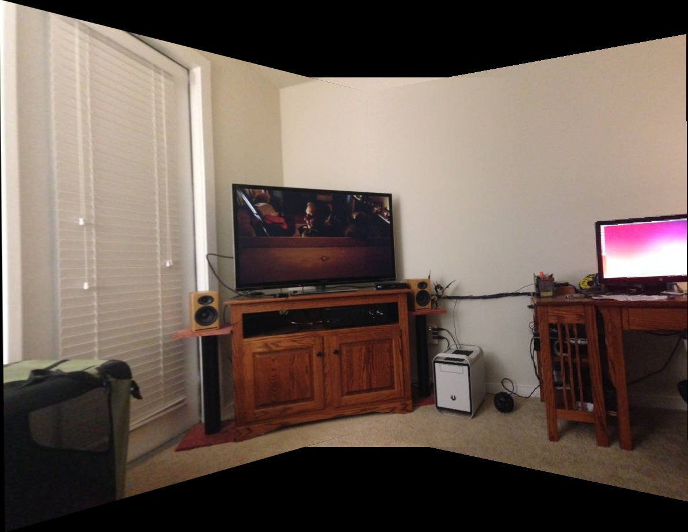
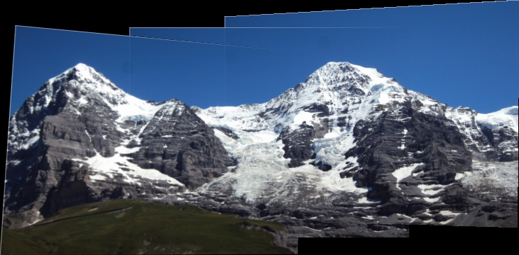
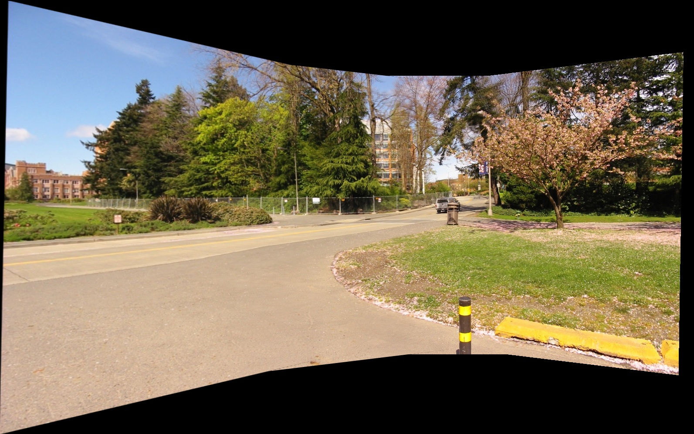

# python-Multiple-Image-Stitching
This is a simple implementation of multiple image stitching using python. Referenced [Multiple Image stitching in Python](https://github.com/kushalvyas/Python-Multiple-Image-Stitching), this repository makes a few small improvements:
1) Adjust the final canvas size to remove excess black background;
2) use linear blending instead of average blending. 
## Results

